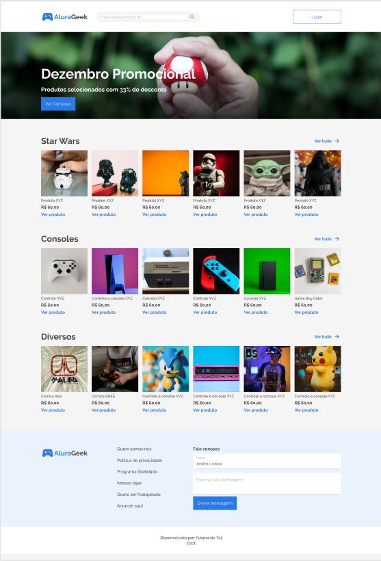

# AluraGeek

## Bem-Vindo 👋

Obrigado por conferir este desafio de codificação de front-end do Chaleng Alura.

## O Desafio

O desafio era construir esta página e-commerce e fazê-la parecer o mais próximo possível do designer.

Os usuários devem ser capazes de:

- Visualizar o layout ideal para o site, observando o tamanho da tela do dispositivo.
- interagir com os botões de LOGUIN;VER PRODUTO (penas do primeiro produto); ENTRAR; ADICIONAR PRODUTO e COM O LOGO.
- Para fazer loguin qualquer email e qualquer senha libera a entrada.

**Para realizar esse desafio, pus em pratica meus conhecimentos em:**

 
  
  

